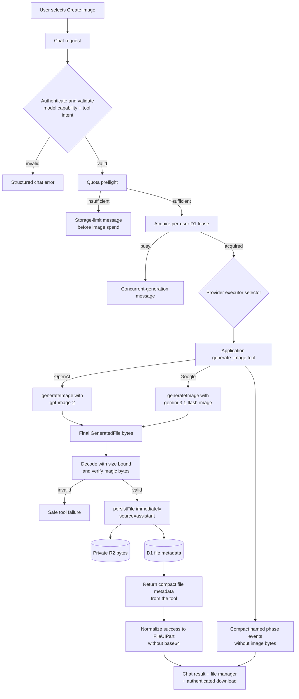

# AI image and file generation plan

Status: Implemented and approved; rollout pending

Owner: Chat and files modules

Last reviewed: 2026-07-15

AI-generated files become private, first-class Besidka files. The image
generation MVP uses the user's provider key, streams an honest generation
state into the chat, persists the final image in the existing R2 bucket, and
adds the result to the user's existing storage quota.

The MVP generates one image per request through supported OpenAI and Google
chat models. It supports only the exact shared aspect ratios `1:1`, `2:3`, and
`3:2`. PDF, PowerPoint, spreadsheet, and other deterministic document formats
remain follow-up work because they need a renderer and security model, not only
another provider executor.

Related documents:

- [Implementation tickets](./files-generation-tickets.md)
- [Current progress](./files-generation-progress.md)
- [Files architecture](../files.md)
- [Chat error handling](./error-handling.md)

## Goals

- Let a user select `Create image` beside the current chat model controls.
- Advertise the tool only on models with a verified generation path.
- Force the selected tool on the first model step so a supported model does
  not answer that it cannot generate an image.
- Use the user's OpenAI or Google key without sending it to the browser or
  storing it in a message.
- Show a stable skeleton, honest named phases, and a final blur-in without
  sending generated bytes through the chat stream.
- Persist validated final image bytes in private R2 storage and metadata in D1.
- Apply the same quota, retention, ownership, deletion, and sharing rules as
  uploaded files.
- Separate uploaded and generated files in the file manager without creating
  a second storage system.
- Provide authenticated inline viewing and explicit downloads from chat and
  the file manager.
- Keep generated bytes and base64 payloads out of D1 chat messages, logs, KV,
  and model replay.
- Fail safely across provider, quota, persistence, and client-disconnect
  boundaries.
- Reject forged tool parts at the request boundary and derive every rendered
  file URL from validated server metadata.

## MVP non-goals

- Image editing, inpainting, variations, or reference-image generation.
- Multiple images in one request or a gallery batch.
- User-selectable quality, resolution, image model, or output format.
- Durable background jobs that survive a Worker request timeout.
- Cross-provider fallback after a provider failure.
- Exact provider image-cost accounting in Besidka's token cost calculation.
- PDF, PPTX, XLSX, DOCX, archive, audio, or video generation.
- Public generated-image URLs.

The follow-up tickets preserve these use cases without making the image MVP
depend on them.

## Locked product decisions

### Use the existing private R2 bucket

Generated images use the same `DATA_BUCKET`, `files` table, and
`persistFile()` path as uploaded files. R2 object keys are flat identifiers;
adding a visual directory prefix does not create isolation or authorization.
The `files.source = 'assistant'` column provides the required separation.

A second bucket would duplicate quota calculation, retention cleanup,
ownership checks, share grants, delete behavior, and local configuration. It
would also increase the chance that one path becomes public or misses cleanup.
The UI therefore separates files by metadata, not by physical storage.

### Keep one generic product capability

Provider model metadata exposes `image_generation`. The chat input renders one
`Create image` control, while the server exposes one provider-neutral
application tool named `generate_image`. A server executor selects the image
model for the user's current provider. Raw provider responses never become the
durable app contract.

### Require explicit user intent for the MVP

The server exposes and forces image generation only when the authenticated
chat request includes the selected `image_generation` tool and the selected
model advertises that capability. This choice prevents prompt injection from
attachments or prior messages from causing an unexpected bill.

The model may call a tool only from the server-approved tool set. Natural
language intent detection can arrive later after measuring false positives;
the MVP does not silently spend money because a prompt happens to mention an
image.

### Generate one image synchronously

One image keeps provider cost, Worker memory, R2 writes, and external
connections bounded. The implementation does not use `Promise.all()` for file
operations. A future job system owns multi-image and long-running generation.

The server also serializes paid image work per user. Each tool instance claims
execution synchronously before its first `await`, then acquires a token-owned
D1 lease before the image-provider call. The lease recovers after 10 minutes if a
Worker dies and becomes a 10-second cooldown when its current owner releases
it. A stale owner cannot shorten a newer lease because release matches both
the user and the random token.

### Preserve original provider bytes

The server stores the validated final PNG, JPEG, or WebP bytes without a
Cloudflare Images transform. Transforming the file can remove OpenAI C2PA
metadata or alter Google's SynthID signal, introduces another billable step,
and creates a second failure boundary.

### Do not retry an ambiguous image request automatically

Image APIs charge for completed generations and do not provide a portable
idempotency guarantee. Image generation uses `maxRetries: 0`. When a timeout
leaves the result unknown, the UI explains the ambiguity and lets the user
choose whether to regenerate.

## Existing foundations

The repository already contains the data and storage scaffolding needed for
this feature:

- `files.source` distinguishes `upload` and `assistant` files.
- `files.originMessageId` links provenance to a chat message.
- `files.originProvider` records the provider without storing a prompt.
- `persistFile()` applies quota policy, writes R2 before D1, rolls R2 back on
  metadata failure, checks quota again after insertion, and invalidates cache.
- `sanitizeMessagesForModelContext()` removes assistant file parts before
  automatic model replay.
- `normalizeAssistantMessagePartsForPersistence()` re-reads a generated file by
  ID and owner, validates its assistant source and provider provenance, and
  derives its durable file part from D1 rather than streamed URLs.
- `enableAssistantFilePersistence` belongs to the older assistant-file
  scaffolding. The custom tool persists its own result and does not depend on
  this legacy flag.

The MVP adds one request-coordination table, `image_generation_locks`. The
generated Drizzle migration creates that table with `user_id` as its primary
key, a random ownership token, expiry, and timestamps. The table has no foreign
key or cascade dependency.

The generated SQL contains only `CREATE TABLE`; it contains no `DROP TABLE` or
table rebuild. The implementation does not apply the migration. Rollout must
follow the guarded preview-first D1 checklist before production enablement.

## End-to-end architecture

### Request contract

The chat request continues to send a tool selection rather than an image model
identifier. The server validates all of the following before generation:

1. The session owns the chat.
2. The requested provider and chat model exist.
3. The model metadata contains `image_generation`.
4. The request explicitly selects `image_generation`.
5. The provider key exists for the current user.
6. The user has enough remaining storage for the maximum accepted MVP image.

The server rejects unknown tools, unsupported model and tool combinations, and
client-supplied provider tool names. A client cannot switch the server to an
unadvertised image model.

The chat POST schema accepts exactly one current user message and allowlists
only text and file parts. It rejects assistant roles, tool parts, dynamic tool
parts, and unknown part fields. The model-capability check runs before the
route persists the user message, so a crafted unsupported request cannot leave
a phantom turn in chat history.

Image generation and web search are mutually exclusive in the interface. If a
crafted request still selects both, image mode takes precedence: the server
omits the provider web tool and exposes only `generate_image`.

### Tool orchestration

The selected tool is mandatory on step zero. The MVP stops after the first
executed tool result and treats the ready tool result as the assistant's
response. It does not spend another language-model step on a prose
acknowledgement. If a future UX adds prose, `prepareStep` must set the second
step tool choice to `none` so a static forced choice cannot generate twice.

The application tool also owns a synchronous one-shot flag. A repeated or
concurrent call against the same tool instance fails before quota, lease, or
provider work begins. The per-user D1 lease protects separate requests and
Worker invocations.

The image-mode developer instruction states that the model must call the image
tool for a valid explicit request and must not claim that image generation is
unavailable. Provider safety policy still takes precedence. No application
prompt can or should bypass a provider safety refusal.

Tool-only assistant messages count as visible chat messages. The client must
not hide a message because it contains a tool or file part without text.

## Provider executors

### Shared application tool

Both providers receive the same application-defined `generate_image` tool.
Its validated input contains one trimmed prompt of 1 to 4,000 characters. The
MVP accepts only `1:1`, `2:3`, and `3:2`, defaulting to `1:1`. Its async
generator yields compact `generating` and `saving` phases, executes AI SDK
`generateImage()`, validates and persists the final bytes inside the server,
then returns safe file metadata. Generated bytes never become a tool output or
UI stream part.

### OpenAI executor

The OpenAI executor uses the authenticated user's provider instance and
`openai.image('gpt-image-2')`.

Initial settings:

- image model: `gpt-image-2`;
- result count: one;
- size: `1024x1024`, `1024x1536`, or `1536x1024`, mapped exactly from the
  shared aspect ratio;
- quality: `medium`;
- output format: `webp`;
- output compression: approximately `85`;
- automatic retries in image mode: `0`.

The initial compatibility allowlist includes only chat model IDs with verified
custom tool-calling behavior. The image executor does not depend on hosted
Responses image-tool support. OpenAI free-tier or unverified organizations may
not have access to `gpt-image-2`; the client maps that response to a
provider-access error instead of a generic server failure.

OpenAI's hosted Responses image tool can stream partial snapshots, but it
returns image base64 through the chat tool stream before Besidka can enforce
its persistence boundary. The MVP does not use that path. A follow-up may add
partials only after it proves quota interception, memory, cost, cleanup, and
no-base64 persistence remain safe.

### Google AI Studio

The Google executor uses the authenticated user's provider instance and
`google.image('gemini-3.1-flash-image')`.

Initial settings:

- image model: `gemini-3.1-flash-image`;
- result count: one;
- image size: `1K`;
- aspect ratio: `1:1`, `2:3`, or `3:2`;
- accepted output: the response's actual PNG, JPEG, or WebP MIME type;
- automatic retries: `0`.

The model ID stays in one server executor so the project can replace it when
Google changes lifecycle dates. The MVP does not use Imagen 4 because Google
has scheduled its shutdown for 2026-08-17. It also avoids retired preview IDs
and the `gemini-2.5-flash-image` model scheduled to shut down on 2026-10-02.

Google does not expose incremental image bytes or meaningful percentage
progress through this path. The shared application tool emits bounded
`generating` and `saving` phases; it never invents a percentage.

### No cross-provider fallback

An OpenAI request never falls back to Google, and a Google request never falls
back to OpenAI. A fallback would change provider terms, safety policy, visual
output, key usage, and cost without user consent.

## Image result validation

Provider output is untrusted binary input even when it comes from an official
SDK. The server reads `GeneratedFile.uint8Array`, never
`GeneratedFile.base64`, and validates the final result before R2 writes:

- accept only `image/png`, `image/jpeg`, and `image/webp`;
- require a `Uint8Array` and reject URL-only results;
- inspect `byteLength` before copying or parsing the result;
- accept at most 10 MiB of image data for the synchronous MVP;
- verify PNG, JPEG, or WebP magic bytes and require them to match the normalized
  media type;
- reject empty, truncated, or multiple-image results;
- derive the extension from the verified media type;
- generate the R2 object key on the server;
- derive a short display filename from the prompt, sanitize it, and use a safe
  fallback such as `generated-image.webp`.

The server never trusts a model-provided path, storage key, content length, or
file extension. It does not execute metadata, parse EXIF scripts, or fetch
embedded resources.

## Quota and persistence

### Preflight before image-provider spend

The server reads the effective storage policy and current usage before calling
the image provider. The MVP requires 10 MiB of remaining space, matching the
largest accepted image. If the reservation does not fit, the tool ends with an
actionable storage-limit error before the dedicated image model can charge the
user.

The per-user generation lease prevents two image requests from spending at the
same time. Uploads can still race the advisory preflight, so `persistFile()`
checks the actual byte count before insertion and verifies total usage again
after insertion. A quota race rolls back the losing file instead of exceeding
the user's policy.

### D1 generation lease

`image_generation_locks` contains one row per active or cooling-down user. An
atomic insert or expired-row replacement acquires the lease with a random
token and a 10-minute expiry. A conflicting live row returns an actionable
`429` response before `generateImage()` runs.

The `finally` path updates the matching token's expiry to 10 seconds in the
future. Token matching prevents a delayed release from modifying a lease that
another request acquired after expiry. The additive migration remains
unapplied until preview rollout.

### Persistence transaction boundary

Cloudflare D1 and R2 cannot share an ACID transaction. The feature uses the
existing compensating transaction:

1. Validate one final `GeneratedFile.uint8Array`.
2. Call `persistFile()` with the actual byte count, `source: 'assistant'`, and
   `originProvider`.
3. Let `persistFile()` write R2, then insert D1 metadata.
4. Delete the R2 object if D1 insertion fails.
5. Roll back both records if the post-insert quota check loses a race.
6. Return a compact live tool result with the file ID, name, verified media
   type, byte count, source, and `/files/<storageKey>` URL.
7. Re-read the file by ID and owner from D1, then verify the storage key, name,
   size, MIME type, assistant source, and provider provenance.
8. Derive the authenticated URL on the server and normalize the result to a
   standard `FileUIPart` before inserting the assistant message.
9. Persist `image_generation` as non-executable tool-use metadata and backfill
   `originMessageId` after the message ID exists.

Once `persistFile()` succeeds, the file is a durable user-owned object. If
assistant-message insertion fails, keep the file with `originMessageId = null`
and log repair context with the file ID and request ID. The live result explains
that the image remains available under `Generated by AI`; deleting it would
break a result the user already received and paid to generate.

If the provenance backfill fails after message insertion, keep both durable
records, leave the origin nullable, and log the same repair context. Provenance
repair must not turn a successful file into a user-facing generation failure.

The MVP never reads the AI SDK result's base64 accessor. No base64 data reaches
`messages.parts`, D1 metadata, KV, evlog, or provider request logs. The model
context sanitizer removes the normalized assistant `FileUIPart` before replay.
A user must deliberately attach a generated image to reuse it.

### Retention and deletion

Generated images inherit the effective user retention policy at persistence
time. Existing single, bulk, and scheduled cleanup paths delete them through
the same safe R2-first semantics as uploads.

## File listing and download

### File manager source filter

`GET /api/v1/files` accepts a validated source filter:

- `all` returns the existing combined view and remains the default;
- `upload` returns user-uploaded files;
- `assistant` returns files generated by AI.

The file manager labels the third choice `Generated by AI`. The filter works
with search, view mode, pagination, selection, rename, and delete. Changing the
filter resets pagination and selection so hidden files cannot remain selected.
Each request captures its search and source values with a monotonically newer
generation. A late response cannot replace results for the user's current
filter.

The upload tab remains an action for adding files. Source filtering belongs in
the browse tab rather than becoming a third top-level modal action.

### Authenticated download

The existing `GET /files/[key]` route remains the only byte-serving path. It
validates owner or share access before reading R2. A validated download query
switches `Content-Disposition` from `inline` to `attachment` and uses the D1
display name with safe ASCII fallback plus RFC 5987 `filename*` encoding.

The response preserves the verified media type, sets `X-Content-Type-Options:
nosniff`, and never accepts a filename from the query. Chat and file-manager
download buttons use the authenticated route and work with browser cookies in
the installed PWA.

Successful persistence normalizes the image to a standard `FileUIPart`, so the
existing share-file extractor adds its file ID to the `chat_share_files`
snapshot. The byte route then applies the normal share grant, expiry, and
revocation checks. A message part never grants access by itself, and deleting
the source file preserves current shared-file behavior.

When a chat already has an active `showFiles` share, successful origin linking
resynchronizes that share so the newly generated image becomes available under
the existing grant. A non-critical synchronization failure records safe repair
context without turning a paid, persisted generation into a user-facing
failure. Ordinary and shared-chat branch creation strips all tool parts before
copying messages, preventing stored tool UI from crossing the trust boundary.

Persisted assistant messages record `image_generation` in their `tools` field
after a live success or failure. This value is metadata, not an executable tool
part. Public shared views expose it only when `showMetadata` is enabled and
always strip tool parts; chats created from shared branches copy neither the
tool parts nor this metadata.

## Chat UX

### Tool discovery

Supported models show an image-generation badge in the model picker and expose
a `Create image` button near the existing tools. Unsupported models do not
offer the control. If a user changes to an unsupported model while the tool is
selected, the client clears the selection and explains why.

The selected control has an accessible label. Besidka continues to use BYOK,
and the MVP does not show an exact image price because provider usage and
pricing units are not portable.

The server owns the storage decision because client storage data can be stale.
When less than 10 MiB remains, the chat shows the structured
`Not enough storage to generate an image` response with instructions to delete
files and retry.

### Generation states

| State | Tool signal | User-visible treatment |
| --- | --- | --- |
| Preparing | Tool input is streaming or available | Fixed-ratio skeleton with preparing status |
| Generating | Preliminary `generating` result | Shimmer and `Generating image` status |
| Saving | Preliminary `saving` result | Skeleton with `Saving to files` status |
| Ready | Compact durable file result | Final image blur-in, filename, open and download actions |
| Failed | Structured tool error | Inline explanation and safe next action |

The skeleton reserves the expected aspect ratio to prevent layout shift. The
UI receives no generated bytes until the ready metadata points at a durable
authenticated file. The final image starts blurred, then sharpens only after
its URL loads.

Both providers use phase labels but no fake progress bar. The interface uses
`aria-live="polite"` for phase changes, respects reduced motion, and does not
announce every visual transition.

The ready card displays a generated filename and the `Generated by AI` source
label. It offers download immediately and remains functional after reload
because the persisted message contains authenticated file metadata, not an
ephemeral data URL. The client validates the ready payload and derives view and
download URLs from its storage key; it ignores streamed URL fields.

The artifact keeps the original generated filename as historical chat text.
If the user renames the file later, the file manager and download response use
the current D1 name without issuing a metadata request for every old chat
card. If deletion or retention removes the file, the card replaces the broken
preview with `Image preview unavailable`; the authenticated route remains
authoritative for any later open or download attempt. Malformed legacy tool or
file parts also remain unavailable, and the client never turns an external or
non-canonical legacy URL into an image or download action.

## Error and recovery contract

### Error categories

| Category | Behavior | User action |
| --- | --- | --- |
| Tool or model unsupported | Reject before provider call | Choose a supported model |
| Storage preflight failed | Reject before image-model call | Delete files and retry |
| Another image is active or cooling down | Reject before image-model call | Wait, then retry |
| Provider key missing or invalid | Structured BYOK error | Add or replace the key |
| Provider billing or access denied | Structured provider-access error | Check billing, tier, or organization verification |
| Provider rate or quota limit | Preserve chat, no automatic retry | Wait or raise provider quota |
| Provider safety refusal | Do not retry or disguise the result | Revise the request |
| Ambiguous timeout | Do not retry automatically | Decide whether to regenerate |
| Invalid provider bytes | Reject before persistence | Retry once manually or change provider |
| R2 or D1 failure | Compensate and omit broken URL | Retry later |
| Quota race after generation | Roll back generated file | Delete files and regenerate |
| Assistant message failure | Retain the generated file with null origin and log repair context | Open it under `Generated by AI` |

Provider errors map into the existing structured chat-error shape. The server
keeps only app-owned error text plus normalized status, code, and request ID
when available. The UI receives a user-facing message, reason, and actionable
fix without raw provider payloads or exception messages.

Live rendering parses only bounded structured errors and maps an explicit code
allowlist to safe user copy. Reload persistence applies its own allowlist of
known codes and messages before replacing the tool error with durable text.
Malformed or unknown error content becomes generic recovery guidance in both
paths.

### Disconnects and duplicate submissions

The existing chat-generation guard, the synchronous tool claim, and the
per-user D1 lease protect different duplicate paths. A client disconnect does
not permit another unbounded generation for the same request. Once provider
execution starts, cleanup and persistence finish on the server stream path
where the current chat architecture already drains the persistence branch.

A request that ends before any final bytes produces no file. A request that
persists a file but loses the client response remains visible after chat
reload. Automated tests cover the persistence and replay boundaries.

## Security and privacy

- Keep provider keys encrypted at rest and server-only.
- Never include a provider key in tool input, UI stream data, logs, or file
  metadata.
- Authorize every list, view, download, rename, and delete operation by owner
  or explicit share grant.
- Treat the normalized generated `FileUIPart` as a share candidate only when
  the chat share snapshot creates an explicit `chat_share_files` grant.
- Keep generated objects private; do not return an R2 public URL.
- Expose image tools only from validated server capability metadata.
- Require explicit current-request intent before a paid tool call.
- Do not let prior assistant text, attached file content, or tool output enable
  a paid tool.
- Do not log prompts, generated bytes, base64, data URLs, or image metadata.
- Reject remote result URLs and prevent SSRF in the MVP.
- Inspect the returned byte length before copying or parsing the image.
- Validate magic bytes before persistence and serve with `nosniff`.
- Preserve provider provenance signals by storing original bytes.
- Process persistence and rollback sequentially to stay below the Worker
  simultaneous-connection limit.
- Apply provider safety outcomes; a forced tool choice is not a safety bypass.
- Allowlist incoming user text and file parts; reject tool or assistant parts
  before message persistence.
- Render generated-image tool UI only for assistant messages.
- Validate every ready field and derive authenticated URLs from a bounded
  storage key instead of trusting streamed `url` or `downloadUrl` values.
- Re-read the generated file by ID and owner from D1 and verify assistant source
  plus provider provenance before creating the persisted file part.
- Accept only canonical internal file links in historical file parts and treat
  invalid legacy links as unavailable.
- Strip tool parts when branching private or shared chats.
- Expose non-executable image tool-use metadata to shared viewers only when
  `showMetadata` is enabled, and omit it from shared branches.
- Convert live and reloaded failures through explicit safe-text allowlists.

## Observability and cost

The request-wide evlog event records safe operational fields under an image
generation block:

- chat provider and model;
- image provider and model;
- tool selected and tool called;
- outcome and total duration;
- normalized error code, provider status, and provider request ID when
  available;
- verified media type and final byte count;
- provider warnings and usage metadata when available;
- lease-release failure as a separate safe code.

Logs never include the prompt, revised prompt, generated content, base64, R2
key, provider key, or full filename. Existing request IDs correlate client,
Cloudflare, and provider failures.

The existing chat token-cost calculation does not fully represent image-tool
charges. The MVP records image usage metadata when the provider exposes it and
does not present a misleading combined price. Exact cross-provider image cost
accounting is a separate ticket because prices and usage units change.

## Testing strategy

### Unit tests

- Capability metadata accepts only known tool values.
- The server rejects unsupported model and tool combinations.
- The single forced step stops after its tool result and cannot call the image
  tool twice.
- A concurrent second `execute()` call fails before its first asynchronous
  operation.
- Filename derivation removes paths, control characters, and unsafe length.
- Byte bounds and PNG, JPEG, and WebP magic-byte validation work.
- Media type and extension mismatches fail.
- Provider errors map to structured chat errors.
- Assistant normalization keeps generated bytes out of the chat stream and
  durable message.
- Assistant normalization rejects a forged or mismatched DB owner, source,
  provider provenance, ID, or file metadata.
- Tool and file parts count as visible assistant content.

### Integration tests

- OpenAI streams honest phases and persists before returning compact metadata.
- Google streams honest phases and persists before returning compact metadata.
- Both executors use the authenticated user's provider instance.
- Quota preflight prevents the mocked provider call.
- A quota race rolls back D1 and R2 state.
- D1 insertion failure deletes the R2 object.
- Assistant-message failure retains the generated file with a null origin and
  logs enough safe context for repair.
- A successful reload contains a standard `FileUIPart` with a
  `/files/<key>` URL.
- Generated files never enter automatic model replay.
- Source filters compose with search and pagination.
- Download uses owner/share authorization and a safe attachment filename.
- Shared-chat extraction grants the generated file explicitly and revocation
  removes access.
- Unsupported and unselected tools never call a provider.
- A live lease blocks another request, an expired lease can be replaced, and a
  stale token cannot release its successor.
- Forged incoming tool parts fail before persistence or provider work.
- Active `showFiles` shares receive newly generated file grants, while branch
  creation strips tool parts.
- Shared views gate persisted tool-use metadata on `showMetadata`, and shared
  branches never copy that metadata.
- Reloaded image failures persist only allowlisted safe text.

### Component and composable tests

- The model picker and chat tool control reflect capability metadata.
- Changing to an unsupported model clears image mode.
- Both providers show phase text without a percentage.
- The final authenticated image uses a CSS blur-in after it loads.
- Tool-only messages remain visible.
- Ready and failed cards render accessible actions.
- Deleted or expired generated files render an unavailable state.
- The source filter resets pagination and selection.
- Chat, grid, and list download actions use the download route.
- Forged tool URLs and user-role tool messages never render or navigate.
- Late source-filter requests cannot overwrite the latest file-manager state.
- Live image failures render allowlisted safe text and use generic guidance for
  malformed or unknown errors.

### Live smoke tests

Mocked tests remain the default CI path and never spend provider credit. A
maintainer performs explicit, opt-in smoke tests with separate low-quota keys
for one supported OpenAI model and one supported Google model in local or
preview environments.

Each live test verifies provider access, one generated image, R2 metadata, D1
provenance, chat reload, file-manager filtering, download filename, delete,
quota rejection, and provider safety handling. The maintainer records request
IDs but never commits prompts, keys, or generated files.

All new test files must be registered in
`scripts/test-affected-check.mjs`. Final validation includes
`pnpm run format`, `pnpm run typecheck`, the affected Vitest suites, and a
production build.

## Rollout and rollback

### Rollout stages

1. Take Time Travel bookmarks for preview and production.
2. Apply the additive lock migration to `chat-preview` and inspect row counts.
3. Run mocked plus opt-in live provider tests in preview.
4. Verify storage counts, generated-file provenance, active sharing, lease
   recovery, error rates, duration, and provider charges.
5. Apply the migration to `chat` only after preview verification and approval.
6. Enable production gradually and monitor the same fields.
7. Expand the provider model allowlist only after live compatibility checks.

### Rollback

Remove `image_generation` from provider capability metadata or revert the
deployment to stop new requests. A rollback does not delete generated files:
existing images remain normal private files and continue to support view,
download, rename, retention, and delete. The legacy
`enableAssistantFilePersistence` flag is not a rollback control for this tool.

Code rollback must preserve `/files/[key]` behavior for previously generated
files. The additive lock table can remain unused after rollback; do not drop it
as an emergency rollback step. A later reviewed migration may remove it only
after the feature no longer needs request serialization.

## Research references

Research was refreshed on 2026-07-15. Implementation must verify model IDs and
lifecycle notices again immediately before production rollout.

### OpenAI

- [Image generation guide](https://developers.openai.com/api/docs/guides/image-generation)
- [Image generation tool guide](https://developers.openai.com/api/docs/guides/tools-image-generation)
- [Images API reference](https://developers.openai.com/api/reference/resources/images/methods/generate)
- [GPT Image 2 model](https://developers.openai.com/api/docs/models/gpt-image-2)
- [Model catalog](https://developers.openai.com/api/docs/models/all)
- [API error codes](https://developers.openai.com/api/docs/guides/error-codes)
- [Rate limits](https://developers.openai.com/api/docs/guides/rate-limits)
- [C2PA metadata](https://help.openai.com/en/articles/8912793-c2pa-in-images)
- [Organization verification](https://help.openai.com/en/articles/10910291-api-organization-verification)

### Google

- [Gemini image generation](https://ai.google.dev/gemini-api/docs/image-generation)
- [GenerateContent image generation](https://ai.google.dev/gemini-api/docs/generate-content/image-generation)
- [GenerateContent API](https://ai.google.dev/api/generate-content)
- [Model deprecations](https://ai.google.dev/gemini-api/docs/deprecations)
- [Gemini API changelog](https://ai.google.dev/gemini-api/docs/changelog)
- [Safety settings](https://ai.google.dev/gemini-api/docs/safety-settings)
- [Rate limits](https://ai.google.dev/gemini-api/docs/rate-limits)
- [Pricing](https://ai.google.dev/gemini-api/docs/pricing)
- [API key guidance](https://ai.google.dev/gemini-api/docs/api-key)

### Vercel AI SDK

- [Image generation](https://ai-sdk.dev/docs/ai-sdk-core/image-generation)
- [`generateImage()` reference](https://ai-sdk.dev/docs/reference/ai-sdk-core/generate-image)
- [`streamText()` reference](https://ai-sdk.dev/docs/reference/ai-sdk-core/stream-text)
- [Tools and tool calling](https://ai-sdk.dev/docs/ai-sdk-core/tools-and-tool-calling)
- [Chatbot tool usage](https://ai-sdk.dev/docs/ai-sdk-ui/chatbot-tool-usage)
- [AI SDK image-tool UI example](https://github.com/vercel/ai#ui-integration)
- [Vercel AI SDK examples](https://github.com/vercel/ai/tree/main/examples)
- [`ai-functions` examples](https://github.com/vercel/ai/tree/main/examples/ai-functions)
- [`generate-image` examples](https://github.com/vercel/ai/tree/main/examples/ai-functions/src/generate-image)

The examples demonstrate provider calls, generated-file access, tool UI part
states, and OpenAI's optional hosted partial images. Besidka's MVP instead
keeps bytes inside one application tool and adds ownership, quota, validation,
durable persistence, cleanup, and Cloudflare connection constraints.

## Decision and assumption log

The task left several product and implementation details open. The following
decisions resolve them without blocking implementation.

| Question | Decision | Reason |
| --- | --- | --- |
| Separate bucket or directory? | Use the existing private bucket and `source` metadata. | R2 prefixes do not authorize; one path preserves quota and cleanup. |
| Which format first? | One generated image. | Images have native provider support and bounded MVP UX. |
| Should natural language auto-enable generation? | No for the MVP; require explicit tool selection. | Prevents prompt-injected or accidental paid calls. |
| How does the model avoid declining? | Expose a verified tool, force it on the single model step, and stop after its result. | Prompt wording alone cannot guarantee a tool call. |
| Can safety be bypassed? | No. | Provider safety remains authoritative. |
| Which OpenAI path? | The shared application tool with `generateImage()` and `openai.image('gpt-image-2')`. | It enforces quota and persistence before compact metadata crosses the chat stream. |
| Which Google path? | Application tool calling a dedicated stable Gemini image model. | Google chat and image generation have separate execution needs. |
| Which Google image model? | `gemini-3.1-flash-image`. | It is the current stable workhorse; preview and Imagen IDs have near-term shutdowns. |
| How many images? | One. | Bounds cost, memory, persistence, and Worker connections. |
| Which aspect ratios? | Only `1:1`, `2:3`, and `3:2`. | Both provider mappings represent these ratios exactly without silently changing composition. |
| What is progress? | Named phases and a final CSS blur-in. | Neither MVP executor exposes a reliable percentage to the client. |
| Should OpenAI partials ship in the MVP? | No; evaluate the hosted tool later. | Base64 would cross the chat stream before the app's persistence boundary. |
| What maximum image size? | 10 MiB for the synchronous MVP. | Provides a clear memory and quota reservation bound for 1K output. |
| Should images be transformed? | No. | Preserves provenance metadata and removes a failure and cost boundary. |
| What if storage is nearly full? | Reserve the accepted maximum before generation, then check actual bytes again. | Avoids a provider charge when persistence cannot succeed. |
| Should provider calls retry? | Not after an ambiguous image request. | Providers lack a shared idempotency contract and may charge twice. |
| Where does the filename come from? | A server-sanitized prompt summary with a safe fallback. | Models never control paths or keys. |
| What happens after rename? | Chat keeps the original name snapshot; file manager and download use the current D1 name. | Avoids a metadata fetch for every historical image card. |
| How are generated files separated? | File-manager source filter. | Users retain one searchable, selectable file library. |
| How are files downloaded? | Authenticated existing file route with attachment disposition. | Avoids public URLs and duplicate authorization logic. |
| Does this require a migration? | Yes, one additive lock table with no foreign keys. | Cross-request serialization needs atomic D1 state; the SQL only creates a table and remains unapplied. |
| What if image and web search are both selected? | Image generation takes precedence. | One forced tool keeps billing and orchestration deterministic. |
| How are duplicate provider calls prevented? | A synchronous one-shot flag plus a token-owned D1 lease. | The flag covers one tool instance; the lease covers concurrent requests and Workers. |
| Can stored tool output choose its URL? | No. | The client validates the ready payload and derives local URLs from the storage key. |
| Should failed OpenAI requests fall back to Google? | No. | Cross-provider use changes consent, billing, and output. |
| Should exact image price appear now? | No. | Existing token cost does not cover all provider image charging units. |
| How do documents fit later? | Provider-produced structured content plus a controlled server renderer. | LLM-authored arbitrary binary or executable documents are unsafe and hard to validate. |
