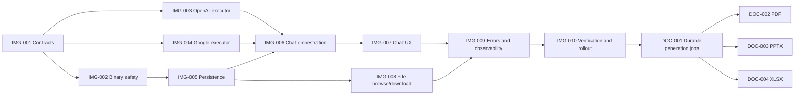

# AI image and file generation tickets

Status: Image MVP implemented; rollout backlog active

Last reviewed: 2026-07-15

These tickets turn the
[AI image and file generation plan](./files-generation-plan.md) into ordered,
reviewable changes. The image MVP reaches production before document formats.

## Dependency map

## Image MVP

### IMG-001: Define capability and tool contracts

Status: Implemented

Dependencies: None

Commit group: `feat(chat): securely generate and persist images`

Scope:

- Add `image_generation` to shared and persisted chat tool types.
- Mark only verified OpenAI and Google chat models as supported.
- Validate request tool values and model compatibility on new and existing
  chat routes.
- Keep provider image model IDs in server executors, not client payloads.
- Add the bounded provider-neutral result and phase types used by the UI.
- Allowlist incoming current-user text and file parts; reject forged tool and
  assistant parts before persistence.
- Update affected-test mappings for every new test file.

Acceptance criteria:

- Unsupported or unknown tool values fail before any provider call.
- Unsupported models cannot enable the tool from a crafted request.
- A model-picker consumer can distinguish image-capable models.
- Existing web search behavior remains unchanged.
- Typecheck prevents provider-specific result data from leaking into the
  durable chat contract.

### IMG-002: Add generated-image binary safety helpers

Status: Implemented

Dependencies: IMG-001

Commit group: `feat(chat): securely generate and persist images`

Scope:

- Accept only AI SDK `GeneratedFile.uint8Array` results.
- Inspect byte length before copying or parsing and reject remote URLs.
- Verify complete PNG, JPEG, and WebP containers against the normalized MIME
  type and bounded image dimensions.
- Derive a safe extension and sanitized prompt-based display filename.
- Reject empty, truncated, mismatched, oversized, and multi-result payloads.

Acceptance criteria:

- The helper accepts valid fixtures for every allowed format.
- The helper rejects spoofed media types and unsafe filenames.
- Oversized input fails before any image parsing or persistence.
- Logs and errors never contain input bytes or base64.

### IMG-003: Add the OpenAI image executor

Status: Implemented

Dependencies: IMG-001, IMG-002

Commit group: `feat(chat): securely generate and persist images`

Scope:

- Add the provider-neutral application `generate_image` tool.
- Validate one trimmed prompt of 1 to 4,000 characters and the exact shared
  aspect ratios `1:1`, `2:3`, and `3:2`.
- Call `generateImage()` with `openai.image('gpt-image-2')`.
- Configure one medium-quality WebP result.
- Yield compact `generating` and `saving` phases without bytes.
- Validate and persist inside tool execution before returning file metadata.
- Disable automatic retries in image mode.
- Normalize missing key, invalid key, billing, organization verification,
  model access, rate limit, safety, and ambiguous timeout failures.

Acceptance criteria:

- An explicitly selected supported model calls the application tool on step
  zero.
- Preliminary outputs contain phases only, never generated bytes.
- One final result reaches validation and persistence exactly once.
- The executor does not advertise unverified chat models.
- Safety failures do not retry.

### IMG-004: Add the Google image executor

Status: Implemented

Dependencies: IMG-001, IMG-002

Commit group: `feat(chat): securely generate and persist images`

Scope:

- Reuse the same server-only `generate_image` tool contract.
- Call `generateImage()` through the user's Google provider with
  `gemini-3.1-flash-image`.
- Generate one `1K` result using `1:1`, `2:3`, or `3:2`.
- Stream bounded `generating` and `saving` states without bytes.
- Validate and persist inside tool execution before returning file metadata.
- Disable automatic retries.
- Map key, billing, rate, safety, prohibited, recitation, no-image, and model
  lifecycle errors.

Acceptance criteria:

- The chat model never receives the provider key as tool input.
- Google phase events do not claim a percentage.
- The executor trusts the returned MIME type only after magic-byte validation.
- Deprecated, preview, and scheduled-shutdown model IDs do not appear in the
  new executor.
- A finish reason that forbids an image does not retry.

### IMG-005: Persist generated files and enforce quota

Status: Implemented

Dependencies: IMG-002

Commit group: `feat(chat): securely generate and persist images`

Scope:

- Add the 10 MiB quota preflight before image-model execution.
- Add a token-owned per-user D1 lease with a 10-minute crash expiry and a
  10-second post-release cooldown.
- Generate an additive `image_generation_locks` migration with no foreign key,
  cascade, table rebuild, or destructive statement; keep deployment outside
  the implementation commit.
- Persist through `persistFile()` with assistant provenance.
- Return only compact authenticated file metadata from the tool.
- Backfill `originMessageId` after assistant-message insertion.
- Keep generated bytes inside server execution and out of persisted message
  parts; normalize successful output to a standard `FileUIPart`.
- Re-read the generated file by ID and owner from D1, verify source and provider
  provenance plus all file metadata, and derive the persisted URL on the
  server.
- Strip normalized assistant file parts from automatic model replay.
- Retain a successfully saved file with a null origin when assistant-message
  insertion fails, and log safe repair context.
- Keep both durable records and log repair context if origin backfill fails.

Acceptance criteria:

- Insufficient storage prevents the provider mock from running.
- Actual bytes count against the existing user quota and retention policy.
- A quota race cannot leave usage above the configured limit.
- Two image requests cannot spend concurrently for the same user, and a stale
  owner cannot release a newer lease.
- An R2 or D1 failure leaves no broken persisted chat URL.
- A successful D1 message contains a standard `FileUIPart` with the
  authenticated file URL and safe metadata.
- Forged output cannot normalize unless its file ID, owner, storage key, name,
  size, MIME type, assistant source, and provider provenance match D1.
- Assistant-message failure does not delete a file already returned to the
  user.
- Generated files remain excluded from automatic model replay.

### IMG-006: Orchestrate image tools in chat

Status: Implemented

Dependencies: IMG-003, IMG-004, IMG-005

Commit group: `feat(chat): securely generate and persist images`

Scope:

- Add the image-mode developer instruction.
- Force the selected image tool on the single MVP model step.
- Stop after the ready tool result without a prose acknowledgement step.
- Ensure a selected image request cannot fall back to a text-only refusal.
- Preserve generation guard, resume, replay, abort, and persistence behavior.
- Treat tool and file parts as visible assistant content.
- Claim the tool synchronously before its first asynchronous operation.
- Give image mode precedence and omit web-search tools if a crafted request
  selects both.

Acceptance criteria:

- One request cannot generate two images because execution stops after the
  first tool result.
- Concurrent calls on one tool instance fail before quota or provider work.
- A valid selected request produces a tool call or a provider safety error,
  not a model capability refusal.
- A request without explicit tool intent never exposes the paid tool.
- Existing web search and text-only chat tests pass.
- Reload returns the normalized `FileUIPart`, and model replay strips it.

### IMG-007: Add generation progress and result UI

Status: Implemented

Dependencies: IMG-006

Commit group: `feat(files): surface generated image files`

Scope:

- Add the model-picker capability badge and chat-input tool control.
- Clear image mode when the user selects an unsupported model.
- Show an actionable server quota error before image-model spend when the user
  must delete files.
- Render preparing, generating, saving, ready, preview-unavailable, and failed
  states.
- Render a fixed-ratio skeleton and honest phase text for both providers.
- Blur in the final authenticated image after it loads.
- Refresh image tool parts after the SDK mutates them in place and triggers its
  shallow message reference.
- Hide the generic chat loader while an image skeleton or named phase is
  visible.
- Use a compact result card, a content-sized image-only bubble, and an
  accessible fullscreen modal.
- Add filename, source label, view, and download actions.
- Keep the active image affordance in the chat input without repeating it in
  the selected-model label.
- Support reduced motion, stable layout, and polite accessibility status.
- Replace a deleted or expired file with an unavailable state.

Acceptance criteria:

- Unsupported models do not offer image generation.
- Known insufficient storage shows an actionable file-manager link before
  submission, while the server still performs the authoritative check.
- Tool-only messages stay visible throughout streaming and after reload.
- The structured server quota error explains how to recover without relying on
  stale client storage data.
- No generated image data crosses the chat tool stream.
- Neither provider displays a fake percentage or indeterminate numeric
  progress.
- A streamed ready result replaces the preparing skeleton without page reload.
- Image progress and the generic loader never appear at the same time.
- The ready state works on mobile, desktop, and the installed PWA.
- UI state tests use `data-testid` selectors.

### IMG-008: Add generated-file filtering and downloads

Status: Implemented

Dependencies: IMG-005

Commit group: `feat(files): surface generated image files`

Scope:

- Add `all`, `upload`, and `assistant` source filtering to the file list API.
- Add `All`, `Uploaded`, and `Generated by AI` controls to the browse tab.
- Style source controls as boxed DaisyUI tabs that match the primary file
  manager switcher.
- Reset pagination and selection when the source changes.
- Ignore late search or source responses after a newer file request starts.
- Add authenticated attachment responses to `/files/[key]`.
- Replace the stored filename suffix with the extension derived from the
  authoritative stored MIME type.
- Use safe RFC 5987 encoding, code-point truncation, ASCII fallback names, and
  bidi-control removal in `Content-Disposition`.
- Add download actions to chat, grid, and list presentations.
- Verify the normalized `FileUIPart` uses the existing share-file snapshot
  extractor without treating the part itself as authorization.
- Resynchronize an active `showFiles` share after generation links the file.
- Strip tool parts when private or shared-chat branches copy messages.
- Persist `image_generation` as non-executable message metadata, expose it in
  shared views only with `showMetadata`, and omit it from shared branches.

Acceptance criteria:

- Source filtering composes with search and pagination.
- Rapid source changes cannot show results from an older request.
- A crafted source value returns a validation error.
- An owner or valid share can download; other users cannot.
- Share revocation or expiry removes generated-file access.
- The server ignores query-supplied filenames.
- Unicode names download correctly with a safe ASCII fallback.
- Converted WebP uploads download with `.webp` even when their original name
  used `.jpg` or `.png`.
- Private file routes remain excluded from robots and sitemap output.
- Upload, rename, select, delete, and bulk delete continue to work.
- Shared views always strip executable tool parts; disabled metadata hides the
  tool-use marker, and shared branches never copy it.

### IMG-009: Complete structured errors and observability

Status: Implemented for the MVP

Dependencies: IMG-007, IMG-008

Commit group: `feat(chat): securely generate and persist images`

Scope:

- Extend structured chat error normalization for image-specific outcomes.
- Record safe outcome, total duration, byte, media, provider, model, usage,
  warning, error-code, provider-status, and request-ID data when available.
- Add actionable quota and BYOK messages.
- Document that existing token cost does not equal total image cost.
- Validate complete ready output in the client, render it only for assistant
  messages, and derive local URLs from a safe storage key.
- Restrict historical file actions to canonical internal links and keep
  malformed legacy parts unavailable.
- Map live stream errors and reload-persisted failures through explicit safe
  allowlists, with generic recovery guidance for unknown input.

Acceptance criteria:

- Provider and persistence failures expose stable app-owned user messages.
- Provider request IDs remain available for support when the SDK error
  provides one.
- No prompt, base64, provider key, R2 key, or generated content reaches evlog.
- A persistence failure is distinguishable from a provider failure.
- Forged `javascript:` or external URLs in tool output cannot control a rendered
  image or download link.
- Invalid legacy file or tool links never become clickable actions.
- Raw or malformed provider error text appears neither live nor after reload.

### IMG-010: Verify, roll out, and open the draft PR

Status: Release gate approved; manual rollout and publishing remain

Dependencies: IMG-001 through IMG-009

Commit group: `docs(chats): finalize image generation rollout`

Scope:

- Register all new tests in `scripts/test-affected-check.mjs`.
- Run format, typecheck, affected suites, full Vitest, and production build.
- Run parallel code, security, and test reviews.
- Resolve every actionable review finding.
- Audit the additive lock migration, verify preview separately, and keep
  production unapplied until the guarded rollout.
- Preserve the user-triggered Google preview evidence and perform the remaining
  opt-in OpenAI smoke test when credentials exist.
- Update the progress ledger with commits, results, and remaining manual work.
- Push the intentional commit series and open a draft PR.

Acceptance criteria:

- `pnpm run format` passes.
- `pnpm run typecheck` passes.
- Relevant and full test suites pass.
- `pnpm run build` passes.
- Full Vitest passes with 117 files and 937 tests.
- Focused follow-up regressions pass with 15 files and 93 tests.
- Migration-clean tests pass with 3 tests, and the affected selector chooses
  all suites because the SEO configuration changes `nuxt.config.ts`.
- The new-test mapping audit finds 9 new test files and 0 missing.
- Final code and security reviewers approve the remediated implementation.
- The generated migration contains only `CREATE TABLE
  image_generation_locks`, with no foreign key, cascade, rebuild, or
  `DROP TABLE`.
- Removing the provider capability stops new generation without hiding
  existing files.
- The draft PR explains architecture, UX, risks, rollout, and test evidence.

## Image follow-ups

### IMG-011: Evaluate OpenAI hosted partial previews

Dependencies: IMG-010

- Prototype `openai.tools.imageGeneration()` behind a separate feature gate.
- Measure partial-image provider cost, stream memory, latency, and disconnect
  behavior.
- Prove quota rejection can happen before the hosted tool spends provider
  credit.
- Ensure partial and final base64 never reach D1, KV, logs, or persisted chat
  parts.
- Preserve immediate R2 persistence and compact final metadata.
- Ship only if the hosted path matches the shared application's safety and
  cleanup guarantees; otherwise retain the skeleton and final blur-in.

### IMG-012: Add reference-image editing

Dependencies: IMG-010

- Let a user deliberately attach one owned image as an edit source.
- Fetch R2 bytes through server ownership checks without public URLs.
- Keep OpenAI and Google edit conversation state provider-specific.
- Preserve Google thought signatures where required for multi-turn editing.
- Persist each result as a new file with explicit lineage metadata.
- Add consent and cost copy before an edit call.

### IMG-013: Add multiple results and generation options

Dependencies: IMG-010, DOC-001

- Move count, quality, size, and aspect ratio to a validated product contract.
- Show estimated provider charge before a multi-image request.
- Use a durable job and bounded sequential persistence.
- Support partial success without hiding per-image failures.
- Add gallery selection and bulk download without public object URLs.

### IMG-014: Add thumbnails without altering originals

Dependencies: IMG-010

- Keep original provider bytes untouched.
- Measure whether file-manager thumbnails need Cloudflare Images transforms.
- Apply existing transform governance and cache policy.
- Make thumbnail failure fall back to the authenticated original.

### IMG-015: Add exact image cost reporting

Dependencies: IMG-010

- Normalize provider-specific image usage and current pricing separately from
  text tokens.
- Version price data and show when a provider omits usage.
- Never block persistence because a cost estimate is unavailable.

### IMG-016: Surface image-generation adoption metrics

Status: Implemented

Dependencies: IMG-010

Commit group: `fix(chats): stabilize image generation experience`

Scope:

- Preserve the existing total-file statistic for API compatibility.
- Count uploaded files from `files.source = 'upload'`.
- Count generated images from `files.source = 'assistant'` and an `image/*`
  MIME type, excluding any future non-image assistant files.
- Move the daily stats cache and client query from v2 to a semantic,
  image-generation-specific namespace that cannot collide with another
  feature preview's shared KV keys.
- Add separate `Files uploaded` and `Images generated` home-page tiles.
- Add safe aggregate counts to the stats request wide event and scheduled
  cache-refresh wide event sent to the configured Axiom drain.
- Add image generation to every product column in the comparison table and
  document the supported behavior in the FAQ, landing feature list, and
  README.

Acceptance criteria:

- Existing records require no migration, backfill, or second counter store.
- An assistant-generated non-image file does not increase the generated-image
  count.
- Public stats never expose prompts, filenames, file IDs, user IDs, storage
  keys, generated content, or API keys.
- The public stats route skips session enrichment before its request event is
  drained.
- Scheduled wide events are explicitly shipped because they run outside an
  HTTP request lifecycle; ordinary stats request events use the normal evlog
  drain.
- A cached legacy or unrelated feature-preview response cannot be mistaken for
  the new response shape.
- Landing copy states that image generation is available and PDF, PPTX, and
  XLSX generation is not yet available.
- Tests cover query separation, fallback fields, UI metrics, cache invalidation,
  and scheduled event shipping.

## Durable document generation foundation

### DOC-001: Design durable generation jobs

Dependencies: IMG-010

Image generation fits one bounded request, but document rendering and batches
can exceed a Worker's request lifetime. Add a durable job model before adding
document formats.

Acceptance criteria:

- A job records owner, chat, requested format, phase, failure, timestamps, and
  resulting file IDs without provider keys or document contents.
- Queue or Workflow execution is idempotent at each persistence boundary.
- Cancellation, retry, expiry, orphan cleanup, and duplicate delivery have
  documented semantics.
- Status resumes after navigation, PWA restart, or Worker redeploy.
- Jobs use bounded concurrency and the same R2/D1 quota contract.

### DOC-002: Generate PDF files

Dependencies: DOC-001

- Ask the model for a validated document schema or constrained Markdown/HTML.
- Render server-side through a reviewed deterministic renderer.
- Block scripts, remote resources, unsafe URLs, and arbitrary filesystem access.
- Validate the `%PDF-` signature, page count, byte bound, and MIME type.
- Persist as `application/pdf` with assistant provenance.
- Add a document skeleton, page-count phase, preview thumbnail, and download.

The implementation must research Cloudflare Worker compatibility and Browser
Rendering cost before selecting a renderer. It must not trust a model-produced
base64 PDF as the primary contract.

### DOC-003: Generate PowerPoint files

Dependencies: DOC-001

- Ask the model for a versioned slide-deck schema.
- Validate slide count, text length, layout tokens, colors, and owned media.
- Render PPTX through a controlled library or sandboxed service.
- Reject macros, embedded executables, external relationships, and unowned URLs.
- Validate the ZIP container, required Open XML entries, byte limit, and MIME.
- Persist as
  `application/vnd.openxmlformats-officedocument.presentationml.presentation`.
- Show slide-count progress and a safe preview separate from the download.

### DOC-004: Generate Excel files

Dependencies: DOC-001

- Ask the model for a versioned workbook schema.
- Validate sheet names, row and column bounds, cell types, styles, and formulas.
- Default to values-only cells; add formulas only through an allowlist.
- Escape CSV/spreadsheet formula injection and reject macros or external links.
- Render XLSX through a Worker-compatible or sandboxed deterministic library.
- Validate the ZIP container, required Open XML entries, byte limit, and MIME.
- Persist as
  `application/vnd.openxmlformats-officedocument.spreadsheetml.sheet`.
- Add sheet and row progress plus an accessible tabular preview.

### DOC-005: Add DOCX and additional formats

Dependencies: DOC-001, lessons from DOC-002 through DOC-004

- Define one format at a time with a constrained intermediate schema.
- Add format-specific content validation and archive-bomb protection.
- Forbid macros, executable attachments, external relationships, and arbitrary
  generated code.
- Reuse the same job, quota, R2, provenance, file-manager, and download paths.
- Add a compatibility and accessibility review for each renderer.

## Commit grouping

The orchestrator created the following reviewable groups:

1. `docs(chats): plan AI image generation`
   - active plan, tickets, progress ledger, and historical-doc pointer;
2. `feat(chat): securely generate and persist images`
   - shared contracts, provider capability metadata, strict request schemas,
     OpenAI and Google execution, binary validation, lease schema and additive
     migration, quota, persistence, sharing, normalization, and server tests;
3. `feat(files): surface generated image files`
   - input control, model badge, honest progress and blur-in UI, safe runtime
     result validation, source filters, race-safe file state, authenticated
     download actions, and client tests;
4. `docs(chats): finalize image generation rollout`
   - resolved findings, validation evidence, progress, rollout notes, and PR
     handoff;
5. `fix(chats): stabilize image generation experience`
   - streamed tool refresh, compact and fullscreen image UX, source tabs,
     MIME-correct downloads, SEO, landing metrics, discovery copy, and tests;
6. `fix(landing): isolate image stats cache`
   - semantic KV and client cache versions discovered through deployed preview
     verification;
7. `docs(chats): record image generation follow-up`
   - final live verification, commit hashes, file-format report, and remaining
     rollout work.
