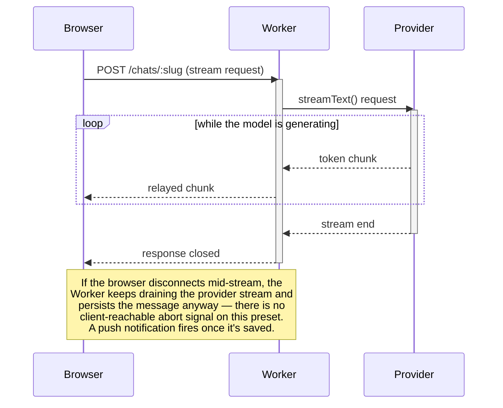
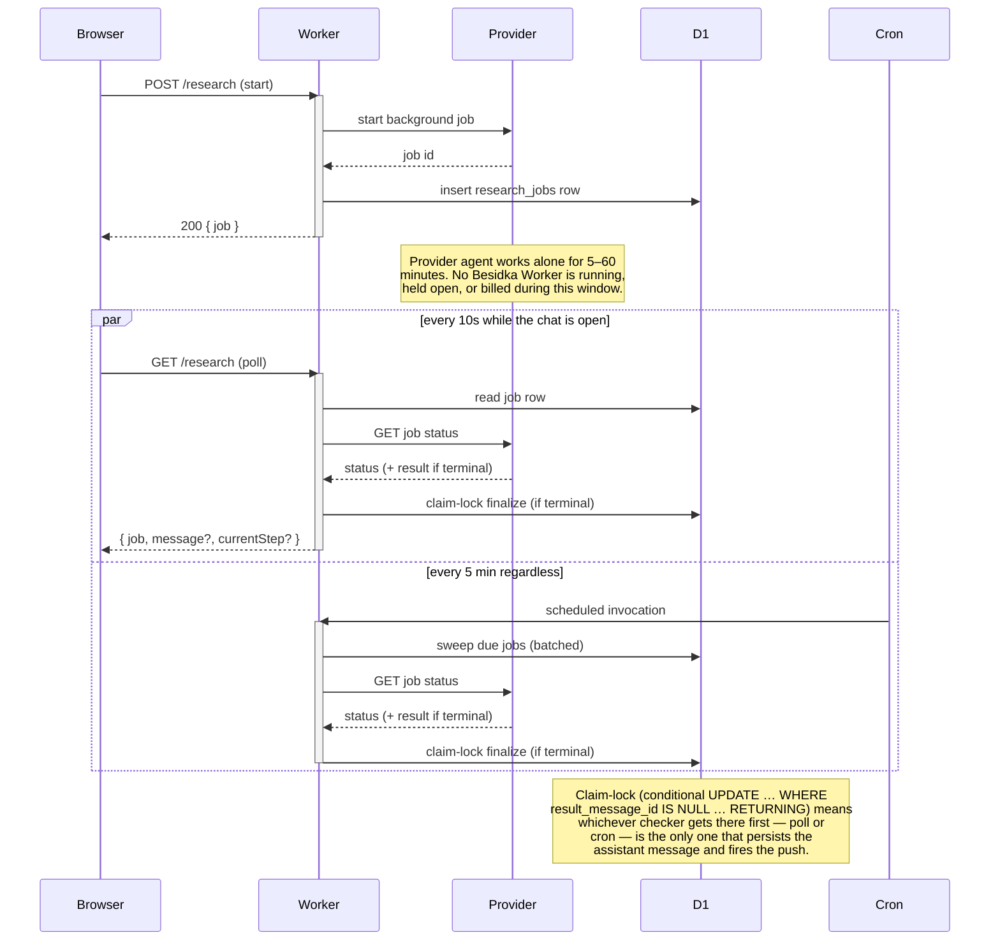

# Deep Research

Deep research runs the providers' own deep-research agents on the user's API
key and delivers a cited report into the chat. It is an **async job**, not a
streaming chat turn: the agent runs entirely on the provider's servers for
minutes to tens of minutes; Besidka starts the job, polls it, and persists the
final report as a normal assistant message.

This is the v2 design. v1 tried to build an agentic loop over provider-executed
web search and failed for structural reasons — see
`docs/deep-research-failed-attempt.md` before changing the architecture.

## Deep research models

Deep research is model-level, not a mode you toggle on top of a regular chat
model. Each dedicated research model is a first-class entry in the model
picker — chosen directly, badged with a telescope icon — and carries its own
fixed `research: ModelResearchConfig` block (`tier`, `assistModel`,
`costEstimate`, `timeEstimate`, `maxToolCalls?`) declared in `providers/*.ts`.
There is no separate quick/thorough menu anymore: picking the model **is**
picking the depth.

| Model | Tier | Cost / time |
|---|---|---|
| `o4-mini-deep-research` (OpenAI) | quick | ~$1, 5–15 min |
| `o3-deep-research` (OpenAI) | thorough | ~$10, 10–30 min |
| `deep-research-preview-04-2026` (Google) | quick | $1–3, under 20 min |
| `deep-research-max-preview-04-2026` (Google) | thorough | $3–7, up to 60 min |

`getModelResearch(model)` (`shared/utils/research.ts`) reads a model's
`research` block; `isDeepResearchModel(model)` is just `!!getModelResearch(model)`.
Runs are billed to the user's own key. `assistModel` in the same config block
names the cheap chat model used for the two pre-calls (clarifying questions
via `generateObject`, brief rewrite via `generateText`). Anthropic has no
deep-research API, so none of its models declare a `research` block — the
trigger never renders for them.

Selecting a research model hides web search, reasoning controls, and file
attachments in `ChatInput` — the agents do their own browsing, and attachments
are rejected server-side (`server/api/v1/chats/[slug]/research/index.post.ts`
returns 400 for any non-text message part). Deep research briefs are
text-only in v2; passing files/images through to the provider's research
agent is future work.

Access gates (surfaced as structured errors with fix text, see
`mapResearchProviderError` in `server/utils/chats/errors.ts`):

- OpenAI: free tier not supported (Tier 1+ billing required); organization
  ID verification is very likely required (inherited from the o3 family).
- Google: the agents are Preview; paid-tier keys expected.

## Architecture

```
ChatInput trigger → clarify form → POST start ─┐
                                               ▼
                            provider REST (background job)
                                               │
client poll (10s, GET) ──── finalize ◄─── cron sweep (*/5, closed app)
                               │
              persist assistant message + web push
```

- **Job store**: `research_jobs` D1 table (`server/db/schemas/research-jobs.ts`).
  One active job per chat enforced by a partial unique index
  (`WHERE status in ('pending', 'running')`). `userId` is denormalized without
  an FK on purpose (cascade blast-radius, see CLAUDE.md D1 section); cleanup
  cascades via `chatId → chats`.
- **Adapters** (`server/utils/research/adapters/`): raw-REST implementations of
  start/status/result/cancel for OpenAI (Responses API, `background: true` +
  `store: true`, `web_search_preview` tool, `max_tool_calls` per model) and
  Google (Interactions API, `background: true` + `store: true`,
  `agent_config.thinking_summaries`). The Vercel AI SDK cannot drive these
  jobs (no background-mode support for OpenAI; Google's `google.interactions()`
  holds the request open while polling internally), so the SDK is used only for
  the assist-model pre-calls and the UIMessage part mapping.
- **Endpoints**:
  - `POST /api/v1/chats/research/clarify` — chat-agnostic clarifying questions.
  - `POST /api/v1/chats/[slug]/research` — start (persists/reconciles the user
    message, rewrites the brief, inserts the job row, calls the provider).
  - `GET /api/v1/chats/[slug]/research` — poll; finalizes on terminal status
    and returns `{ job, message?, currentStep? }` (`message` only when
    completed; `currentStep` only while non-terminal and the adapter
    surfaced a latest trace entry — see the live current-step note below).
  - `POST /api/v1/chats/[slug]/research/cancel` — cancel (idempotent).
  - `PUT /api/v1/chats/new` accepts optional `research: { answers }` (the
    model itself already implies the tier) so a research chat starts
    atomically — the target page discovers the job via the chat GET's
    `activeResearchJob`; no client-side stash exists.
- **Finalize** (`server/utils/research/finalize.ts`): shared by the GET poll
  and the cron sweep. Claim-lock idempotency via conditional
  `UPDATE … WHERE result_message_id IS NULL … RETURNING` — exactly one caller
  persists the report (text part + one `source-url` part per citation + a
  `data-research` metadata part) and fires the push
  (`tag: 'besidka-research-ready'`, generic payload, never report content).
  Overall timeout: 90 minutes → cancel + `research-timeout` error.
- **Cron sweep** (`server/plugins/research-job-sweep.ts`, `*/5 * * * *` in
  `wrangler.jsonc`): finalizes jobs whose owner closed the app, so the push
  still fires. Gated by `controller.cron`; the other scheduled plugins carry
  matching guards so multiple cron schedules don't cross-fire. Config via
  `researchSweep*` runtime keys (`NUXT_RESEARCH_SWEEP_ENABLED` etc. — see
  `.dev.vars.example`). Enabled for preview and production via the `vars`
  blocks in `wrangler.jsonc` (both the top-level preview block and
  `env.production.vars`); local dev keeps the `nuxt.config.ts` default of
  `false` — run the sweep manually or via `.dev.vars` if you need it locally.

## Runtime model: how research differs from regular chats

A regular chat turn and a research job both end up as an assistant message
in the same chat, but they get there through opposite runtime shapes. A
regular turn is a single held-open streaming request: the Worker sits
between the browser and the provider for as long as the model is talking,
relaying tokens as they arrive. A research job is the inverse — the Worker
is never held open while the work happens. It makes a short request to
start the job, then gets out of the way; the provider's agent runs
unattended on its own infrastructure, and two independent, short-lived
checkers (browser poll, cron sweep) come back later to collect the result.



A research job never holds a Worker open across the run at all. Starting
it is one short request; finding out it finished is two more independent
short requests that repeat until a terminal status shows up:



### Cloudflare Workers limits — why polling is safe

The concern this shape has to answer: Workers are billed and bounded by
**CPU time**, not wall-clock time, so is it safe to leave a job running on
someone else's infrastructure for up to an hour while our Worker does
nothing? Yes, and the reason is that "our Worker does nothing" for that
entire hour — literally no Besidka code is executing.

- A streaming chat request can occupy the connection for minutes of
  wall-clock time, but nearly all of that is spent waiting on network I/O
  (reading provider chunks, writing them to the client) rather than
  executing our code, so its actual CPU time is tiny. Cloudflare doesn't
  meter wall-clock wait time against the CPU budget — only compute does.
  Workers Paid's default CPU budget is 30 seconds per request (raisable up
  to 5 minutes via `limits.cpu_ms` in `wrangler.jsonc`), and this project
  doesn't need to touch that default for chat streaming to be safe.
- Each research poll is a brand-new, independent request that lives for a
  fraction of a second: session auth, two D1 queries (read the job, maybe
  claim-lock finalize), and one provider status `GET`. It starts, finishes,
  and the Worker moves on — there's nothing to hold open.
- The cron sweep invocation is bounded the same way: it processes at most
  `researchSweepBatchSize` jobs (20 by default) and gives up once
  `researchSweepMaxRuntimeMs` (20 seconds by default) has elapsed, both
  configurable via the `NUXT_RESEARCH_SWEEP_*` vars in `wrangler.jsonc`.
- Across the 5–60 minutes the provider agent is actually working, there is
  no Besidka Worker invocation in flight at all — not idling, not
  polling internally, not paying CPU time. The job lives entirely on the
  provider's side until a poll or the cron sweep asks about it.

### Why polling and not webhooks

Webhooks would be the more usual way to learn "a long job finished," but
neither provider's webhook story fits a bring-your-own-key app:

- OpenAI's `response.completed` webhooks are configured per-organization
  in the OpenAI dashboard. In a BYO-key app, every user's own OpenAI
  organization would have to be manually configured to call our endpoint
  — there's no API to do this on the user's behalf, so it isn't viable
  at any scale beyond a single hand-configured account.
- Google's Interactions API has no webhook mechanism at all; the only way
  to learn a job's status is to poll it.

Polling with the user's own key, backstopped by the cron sweep for when
the app is closed, gives equivalent delivery with a bounded worst-case
lag: at most 10 seconds while the chat is open (the browser poll
interval), and at most 5 minutes when it isn't (the cron sweep interval)
— either way, comfortably inside what a multi-minute research job's user
is already expecting to wait.

## Frontend

- `app/composables/chat-input.ts` — `useChatInput()`: resolves
  `researchConfig`/`isDeepResearchModel` for the currently selected model via
  `getModelResearch`/`isDeepResearchModel` (`shared/utils/research.ts`).
- `app/composables/chat-research.ts` — `useChatResearch()`: the poll state
  machine (10s network poll + 1s local elapsed tick, immediate poll on
  `visibilitychange`/`focus`, dedupe-by-id message append on completion).
- `app/components/Chat/DeepResearchPending.vue` — honest progress: merged
  header (provider logo + status + model/tier + elapsed), progress bar, an
  `alert-info alert-soft` expectation box, and an optional live current-step
  (kind icon + parsed title/description, blinking skeleton title) fed
  defensively from the poll response's `currentStep`; cancel; error state
  renders the structured `message`/`why`/`fix`; dismiss on terminal states.
  The current-step section renders only when the provider/mock actually
  surfaced one for that poll — see the live current-step note in the
  live-spike section below; unlike v1's fabricated step timeline, absence is
  the honest default.
- `app/components/Chat/DeepResearchMeta.vue` — report header from the
  `data-research` part.
- `app/components/Chat/DeepResearchClarify.vue` — clarifying-questions form
  (salvaged from v1).
- `app/components/ChatInput/ModelsTrigger.vue` — the model picker badges every
  deep research model with a telescope icon and shows `costEstimate ·
  timeEstimate` as its price tooltip instead of the regular per-token price.
- `app/components/ChatInput/DeepResearchTrigger.vue` — once a research model
  is selected there is no level menu to open; it renders as a static "Deep
  research" pill (telescope icon, same cost/time estimate as a tooltip) —
  the model choice already fixed the tier. `ChatInput.client.vue` hides the
  web-search toggle, reasoning controls, and file-attachment trigger whenever
  `isDeepResearchModel` is true (the agents browse on their own, and
  attachments aren't supported yet — see above); while a job is running, send
  and the cancel control are disabled/enabled accordingly.

## Live-spike checklist (before enabling in production)

Several provider payload details are documented at medium confidence and the
parsers are deliberately defensive. Verify against real paid keys once:

1. OpenAI: does polled `GET /v1/responses/{id}` return usable terminal
   `output` + `annotations`? Do tier/verification failures match
   `mapResearchProviderError`'s matchers?
2. Google: exact `steps`/citation JSON paths; status enum values beyond
   `in_progress`/`completed`/`failed`; paid-tier gating error shape.
3. D1: the 409 duplicate-active-job path relies on the SQLite unique-constraint
   error wording — confirm against a real constraint violation.

Start with the cheap pair (o4-mini ≈ $1, Gemini standard ≈ $1–3).

**Live current-step mid-run (round 7 research):** feasibility differs
sharply by provider. OpenAI's background `GET /v1/responses/{id}` does
**not** return partial `output` while the job is `in_progress` — item-level
progress on the Responses API is a streaming-only feature, so the
defensive trace extraction in `openai.ts`'s `status()` is a no-op against
real OpenAI runs and the pending block's current-step section simply never
appears (graceful absence, not a bug). Google's Interactions API looks more
promising: production reports suggest `steps[]` accumulates as the
interaction runs and is retrievable through the same polling `GET`
(moderate confidence — evidence from third-party production reports, not
yet verified against a live paid key), so real Gemini deep-research runs
likely do surface a live current-step. The mock adapter always simulates
step progression (`MOCK_CURRENT_STEPS`, six-step rotation over its 45s
lifecycle), so the current-step UI is fully exercised on preview regardless
of provider truth. Net effect: current-step lights up for mock always,
Gemini likely, OpenAI not yet — closing the OpenAI gap needs a
streaming-resume path (subscribing to the background response's event
stream instead of polling `GET`), tracked as future work.

## Testing

Unit specs mirror source paths (`tests/unit/utils/research*`,
`tests/unit/components/Chat*/DeepResearch*`, `tests/unit/composables/chat-research.spec.ts`);
integration specs cover clarify/start/status/cancel and the cron sweep. All are
registered as the `deepResearchTests` group in `scripts/test-affected-check.mjs`.
